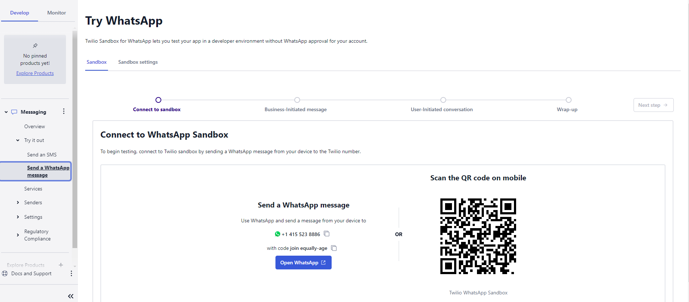
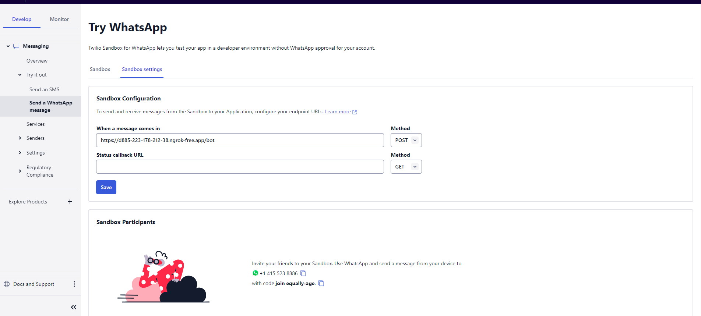
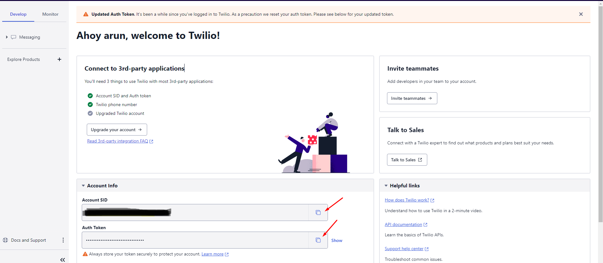
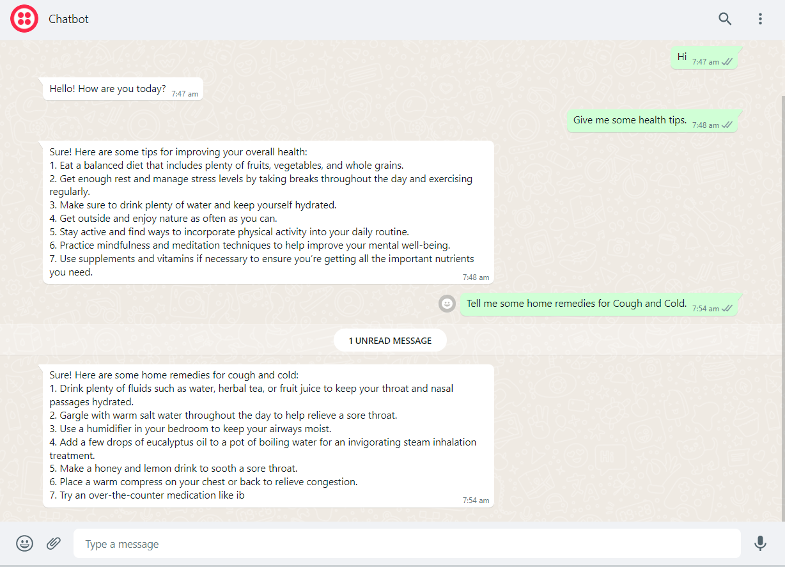

# ChatGPT Whatsapp Bot using Twilio

# System Requirement

python>=3.8

# 1. Open terminal and clone repo

git clone https://github.com/arundevops47/ChatGPT-WhatsApp-Twilio-Bot.git

# 2. Create virtual environment in working directory and activate it.

`For Window`
```shell
cd ChatGPT-WhatsApp-Twilio-Bot
python -m venv venv
venv\Scripts\activate
```

`For ubuntu`

```shell
python -m venv venv
source venv/bin/activate
```

# 3. Install packeges

```shell
pip install -r requirements.txt
```

# 4. Get Openai API key

Creat your OpenAI account from https://platform.openai.com and get API Key from https://platform.openai.com/account/api-keys

# 5. Create .env file into your working directory and add these variables

```
OPENAI_API_KEY=
TWILLIO_AUTH_TOKEN=
TWILLIO_ACCOUNT_SID=
FROM_WHATSAPP_NUMBER=
MAX_TOKENS=512
CONVERSATION_EXPIRES_MINS=5
ALLOWED_PHONE_NUMBERS=
```

# 6. Setup ngrok


`Installation ngrok in window`

1. Signup ngrok and get auth token from [here](https://dashboard.ngrok.com/get-started/your-authtoken)
2. Download the ngrok ZIP file
3. Unzip the ngrok.exe file
4. Place the ngrok.exe in a folder of your choosing
5. Make sure the folder is in your PATH environment variable
6. ngrok config add-authtoken <token>

Make sure the folder is in your PATH environment variable


`Installation ngrok in ubuntu`

1. Download TGZ file from url https://ngrok.com/download
2. sudo tar xvzf ~/Downloads/ngrok-v3-stable-linux-amd64.tgz -C /usr/local/bin
3. ngrok config add-authtoken <token>
4. ngrok http 5000

# 7. Run the Whatsapp bot

Open another terminal and run the app with command "python app.py".

(Make sure in new tab - source venv/bin/activate)

# 8. Configure Twilio WhatsApp

Signup Twilio [twilio.com](https://twilio.com) and go to [console.twilio.com](https://console.twilio.com/us1/develop/sms/try-it-out/whatsapp-learn)


You need connect Twilio sandbox with WhatsApp. Scan code which you find on Twilio.




From ngrok terminal copy "https://" url then append /bot with url and paste it in Twilio message sandbox settings. 

 


Get Account SID and Auth Token from [here](https://console.twilio.com/)

 

Paste it in your .env


# 9. After setup send message from Twillio sandbox

If you are successful, you should receive a message as

Twilio Sandbox: ✅ You are all set! The sandbox can now send/receive messages from whatsapp:+14155238886. Reply stop to leave the sandbox any time.

Start chatting with the bot as below 

 
